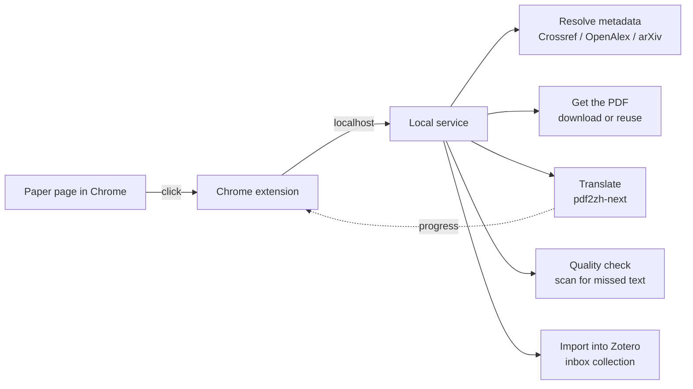

# PaperPipeline

**One click on a paper page turns it into a translated, catalogued Zotero entry.**

You open a paper in your browser, click a button, and end up with four files in
Zotero (the original PDF, a bilingual PDF, a translated PDF, and the glossary)
plus complete bibliographic metadata. No manual downloading, no folder sorting,
no copy-pasting fields.

Built for people who read a lot of papers and are tired of the same five-step
ritual every time.

> 中文说明见 [README.zh-CN.md](README.zh-CN.md)。

---

## What it does

The manual routine usually goes: find the paper, download the PDF, drop it in a
folder, run a translator over it, wait, drag the results into Zotero, fix the
metadata, decide which collection it belongs in.

PaperPipeline collapses that into one click. The paper lands in an inbox
collection with everything attached, and you sort it into a real collection
later, after you have actually read it.

### The flow

### What lands in Zotero

| Attachment | What it is |
| --- | --- |
| Original PDF | The paper as published |
| Bilingual PDF | Source and translation side by side |
| Translated PDF | Translation only |
| Glossary CSV | The term table the translator built |

Metadata (title, authors, year, venue, DOI, pages) comes from Crossref or
OpenAlex, so it is authoritative rather than guessed.

---

## Features

- **Detects papers automatically.** It reads the citation metadata tags that
  arXiv, ACL Anthology, IEEE, Springer and most publishers provide, falling back
  to JSON-LD and URL patterns.
- **Real progress.** The panel shows the current stage and a live percentage,
  not a spinner. You can close the tab; the job keeps running.
- **Skips the bibliography.** It finds where references start and translates only
  the body. Cheaper and easier to read. Falls back to full text if detection
  fails.
- **Verifies its own output.** It scans the translated PDF page by page for
  English prose left behind, and retries in compatibility mode when it finds any.
- **Reuses what you already downloaded.** If the PDF is already in your Downloads
  folder, it will not fetch it again.
- **Queues instead of racing.** One paper at a time, so you never trip your
  provider's rate limit.
- **Waits for Zotero.** If Zotero is closed, the job parks at the import step and
  finishes when Zotero comes back.

---

## Requirements

| Component | Notes |
| --- | --- |
| Windows 10 / 11 | Uses the registry for autostart and Windows paths throughout |
| Python 3.9+ | Runs the local service |
| Zotero 7 or newer | The library that receives everything |
| Chrome or Edge | Where the extension lives |
| An OpenAI-compatible LLM endpoint | Does the translating, see step 3 |

---

## Install

### 1. Prepare the translation environment

Translation is done by pdf2zh-next, which has heavy dependencies (PyMuPDF,
layout models) and needs its own environment.

With conda:

    conda create -n pdf2zh_next python=3.11 -y
    conda activate pdf2zh_next
    pip install pdf2zh-next

With venv:

    py -3.11 -m venv C:\tools\pdf2zh
    C:\tools\pdf2zh\Scripts\pip install pdf2zh-next

Note where that python.exe lives. The wizard will ask for it, and will actually
import the engine to confirm it works.

> The first translation downloads a few hundred MB of model assets. Expect a
> pause on your very first paper.

### 2. Run the wizard

Double-click **install.cmd**.

It walks through five questions (Zotero data directory, translator Python, model
credentials, Downloads folder, inbox collection name), explaining what each one
is for. Then it writes the config, creates the Zotero collection, and optionally
registers autostart.

### 3. Load the browser extension

1. Go to chrome://extensions
2. Turn on **Developer mode** (top right)
3. Click **Load unpacked**
4. Select the extension folder in this project

Open any paper page and a button appears in the bottom-right corner.

---

## Configuration

Everything lives in config.json, which the wizard writes. After editing, restart
the service with pipeline.cmd restart.

### service

| Field | Default | Meaning |
| --- | --- | --- |
| port | 8787 | Loopback port, bound to 127.0.0.1 only. If something else uses it, change this **and re-run install.cmd**, since the extension stores it too. |

### paths

| Field | Meaning |
| --- | --- |
| pythonw | Windowless Python, used for the silent autostart entry. Empty means no autostart. |
| translatorPython | The python.exe of the environment holding pdf2zh-next. Translation runs as a subprocess of it. |
| zoteroDataDir | Zotero data directory. Only used to create the inbox collection. |
| downloadDirs | Folders searched for a PDF you already downloaded. |

### translator

| Field | Default | Meaning |
| --- | --- | --- |
| openai_base_url | (required) | Endpoint, usually ending in /v1 |
| openai_api_key | (required) | Your key. **Stored in plain text locally**, so do not commit or share this folder. |
| openai_model | (required) | Model name, exactly as your provider writes it |
| lang_in | en | Source language |
| lang_out | zh-CN | Target language |
| qps | 10 | Max translation requests per second |
| pool_max_workers | 20 | Concurrency. Rarely needs changing. |
| term_qps | 10 | Separate rate limit for the terminology pass |
| term_pool_max_workers | 20 | Concurrency for the terminology pass |
| watermark_output_mode | no_watermark | no_watermark, watermark, or both |
| stop_at_references | true | Translate only up to the bibliography |

**On qps:** raise it and you go faster until you hit rate limits. 10 is fine for
most paid plans; drop to 2 to 4 on free tiers. A 429 in the logs means it is too
high.

### zotero

| Field | Default | Meaning |
| --- | --- | --- |
| tempCollection | 00 TEMP | Inbox collection for new papers |
| tags | 待读, 自动入库 | Tags applied to every import |

---

## Usage

### Everyday flow

1. Open a paper page in your browser
2. Click the button in the bottom-right corner
3. Confirm the detected title and click through
4. Watch the progress (a 10-page paper takes 3 to 6 minutes)
5. Collect it from the inbox collection in Zotero

Closing the tab does not stop the job. The toolbar icon shows what is running.

### Managing the service

| Action | How |
| --- | --- |
| Check status | double-click pipeline.cmd |
| Restart | pipeline.cmd restart |
| View logs | pipeline.cmd logs |
| Stop | pipeline.cmd stop |
| Self-check | python selftest.py |

### Where the files go

    paper-pipeline/
      config.json          your settings (contains the API key)
      state.json           runtime state and access token
      logs/service.log     service log
      work/<job-id>/       per-paper intermediate files
        original.pdf
        translated/
        worker.err.log     translator log, look here when something fails
      extension/           the browser extension
      vendor/              reference detection and quality check

Zotero copies attachments into its own storage, so the copies under work/ are
redundant and safe to clean up periodically.

---

## How it works

Three pieces, because the constraints force it.

**The Chrome extension cannot run local programs**, and its service worker gets
recycled at will. So it only talks HTTP.

**The translator lives in a different Python environment** and uses
multiprocessing internally. Rather than importing it, the service runs it as a
subprocess, so a crash in the translator cannot take down the service.

**Zotero's local API is read-only.** Writes go through the connector protocol
that the official Zotero Connector uses, which means three calls per paper:
saveItems, updateSession (collection and tags), then saveAttachment per file.

Progress is real because the translator exposes an async event stream
(do_translate_async_stream) that emits stage names, item counts and an overall
percentage. The service relays those events to the extension.

### Quality safeguards

The translator's exit code is not trustworthy, so the pipeline verifies the
output itself:

1. vendor/detector.py locates the bibliography boundary before translating
2. vendor/quality_check.py scans the translated PDF for untranslated prose
3. If anything is found, the paper is retranslated in compatibility mode

---

## FAQ

**The button does nothing, or says it cannot reach the service.**
The service is not running. Double-click pipeline.cmd to check, then run
pipeline.cmd restart.

**"Could not find or download the PDF."**
Usually a paywall. Download it manually, put it in one of your downloadDirs, and
try again.

**Translation is slow or returns 429.**
Lower translator.qps to 3 and restart.

**Nothing appears in Zotero.**
Check that Zotero is running. Jobs queue while it is closed and finish once it
starts.

**The collection was never created.**
Creating it requires Zotero to be closed. Quit Zotero and re-run install.cmd.

**A job seems stuck.**
Read work/<job-id>/worker.err.log. If it really is dead, restart the service and
resubmit.

**Can I change the model later?**
Yes. Edit the three openai_ fields in config.json and restart.

---

## Uninstall

1. pipeline.cmd stop
2. Remove autostart:

       reg delete "HKCU\Software\Microsoft\Windows\CurrentVersion\Run" /v PaperPipeline /f

3. Remove the extension from chrome://extensions
4. Delete the project folder

Nothing in your Zotero library is deleted by uninstalling.

---

## Security and privacy

- The service binds to 127.0.0.1 only and requires a random token that the wizard
  generates, so other pages on your machine cannot drive it.
- Your API key stays in config.json and goes only to the endpoint you chose.
- Paper content is sent only to that same endpoint.
- Outbound requests are limited to metadata lookups (Crossref, OpenAlex, arXiv)
  and your configured translation endpoint.

## Not a goal

- Deciding which permanent collection a paper belongs in. That is your call after
  reading it.
- Modifying existing items or collections in your library.

## License

MIT
